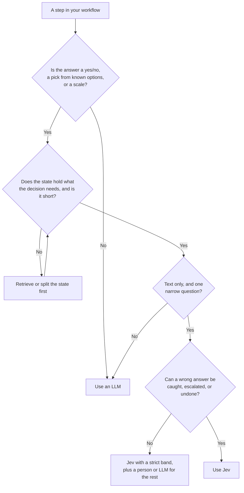

# Use Cases and Limits

Use Jev at any step where software must choose between known options, but needs to understand language to do it. The five videos show the groups below. The source of each use case is in brackets.

## What Jev is good for

### Guard the agent

- Gate Bash commands as read-only, reversible, or irreversible. Block force pushes and `find -delete` variants that a pattern list misses. (IndyDevDan, levels 4 and 6)
- Block edits that break the project rules for that file. (AI LABS)
- Detect prompt injection in user input or tool output. (IndyDevDan level 1, Witteveen)
- Block writes to secret files such as `.env`. (IndyDevDan level 6)

### Route the work

- Pick the skill for a prompt, or none. With many skills, pick a category first, then a skill. (AI LABS, Witteveen)
- Route to a model (cheap or strong) or to an agent (browser, fast, desktop). (IndyDevDan level 5, Witteveen)
- Map plain words to a function name: a command bar that routes deep into an app. (How I AI)
- Decide when to compact: the context is large and the task changed. (IndyDevDan level 7)

### Find and judge information

- Answer questions about files without reading them into the agent's context, one file or a whole glob. (IndyDevDan levels 8 and 9)
- Keyword search, then rank the candidate files in batches. (AI LABS)
- Rerank RAG chunks before they go to the LLM. (Witteveen)
- Check that each documented rule has a test. Check that each checklist item is done. (AI LABS, How I AI)

### Check and triage work

- Seven yes/no risk questions select a quick or a full code review. (AI LABS)
- Composite scores: one score per dimension, weights in code. (IndyDevDan level 3)
- Classify a test failure, then verify the fix. The agent calls Jev as a tool. (IndyDevDan level 10)
- Support ticket triage: type, priority, urgency. (IndyDevDan level 2, Witteveen)

### Process data at scale

- Find and merge duplicate records with a strict threshold, then let an LLM check a sample. (How I AI)
- Group pull requests or comments by theme with pair-wise comparison. (How I AI)
- Filter API or polling results before they go into the context. (Witteveen)

### Real-time interfaces

- Voice to-do list: is the phrase complete, which task, which action. (How I AI)
- Presentation coach: tick off talking points as you speak. (How I AI)
- Browser and game control: a page is a short list of buttons, not every pixel. (How I AI, AI LABS)

## IndyDevDan's 10 levels

```
 10  Jev as a tool the agent calls    ▲  the agent decides when to ask
  9  Questions about a whole glob     │
  8  Questions about one file         │
  7  Compaction advice                │
  6  Secret-file and command guards   │
  5  Model and agent routing          │
  4  Bands: pass / ask / block        │
  3  Composite scores, weights in code│
  2  Ticket triage                    │
  1  A smart if statement             │  code decides when to ask
```

## Use Jev or an LLM



| Use Jev when | Use an LLM when |
| --- | --- |
| The answers are a known set, a yes/no, or a scale. | You need text, code, or an explanation back. |
| The state is short and contains what the decision needs. | The answer needs multi-step reasoning, or facts joined from several sources. |
| The decision repeats many times, or must be fast. | The state is very long. Accuracy drops on long inputs. |
| A wrong answer can be caught, escalated, or undone. | The input is an image. Jev is text only. |
| | The question is compound. Split it, or use an LLM. |
| | The work is open or creative, ex. "what on this page confuses users?" |

## Two warnings

- **Jev can be prompt injected too.** If the state can contain untrusted text, ask an injection question first, or keep that text out of decisions that act.
- **The hosted API sends your state off your machine.** For private data, see the local models in [Speed, cost, and local models](07-performance-and-local.md).
