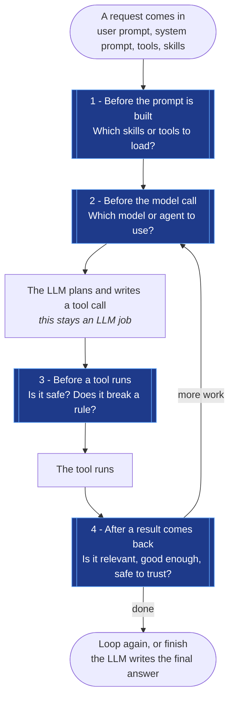
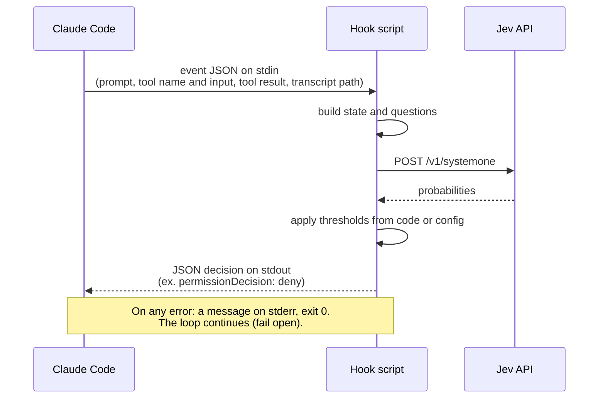
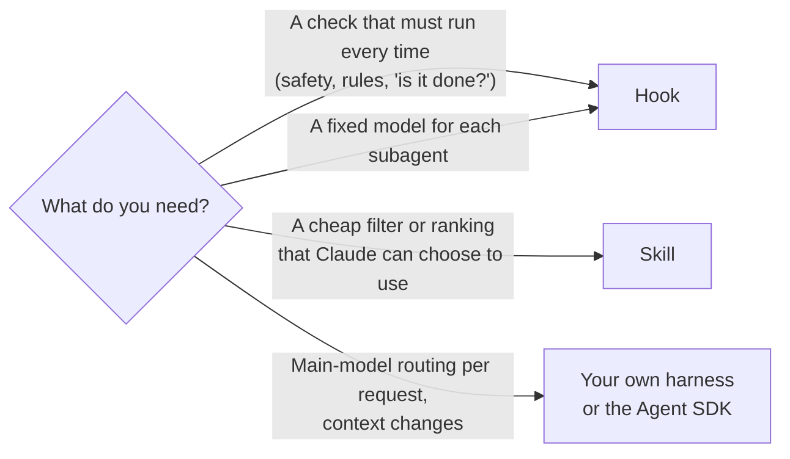

# Jev in an Agent Loop

Most model calls in an agent loop make decisions, not text. Sam Witteveen names four points where a decision model plugs in. At each point, the code is the same small piece:

1. Build the state from what the loop already has.
2. Ask the questions.
3. Branch on the probabilities.

## The four decision points



## Three ways to insert Jev

What matters is **who decides when Jev runs**: the harness, the agent, or your code.

| Pattern | Who calls Jev | How it works | Notes |
| --- | --- | --- | --- |
| **Hooks around the LLM** | The harness | Jev runs at fixed points. The LLM never sees it. | The most common pattern. It runs each time, and the model cannot skip it. LangChain ships this as middleware. |
| **Jev as a tool** | The agent | Give the agent an `ask_jev` tool. The agent decides when to ask. | IndyDevDan level 10: classify test output, check a fix, ask about files without reading them. |
| **Jev runs the loop** | Your code | Jev picks the next step. It hands off to the LLM only when it is unsure or when text is needed. | Cuts the most LLM calls, but it is a much larger change. Weaker on complex tasks (Witteveen). |

In Claude Code, these patterns map to three mechanisms.

### 1. Hooks: the harness runs Jev at fixed points

Each decision point is a Claude Code hook event. You register a script in `settings.json`. Claude Code then runs the script each time that event occurs. Claude does not choose to run it and cannot skip it.

```
 user prompt
     │
     ▼
 UserPromptSubmit ──► jev-skill-picker, jev-compact-advisor   (points 1 and 2)
     │                 output: extra context for Claude, or a message to the user
     ▼
 Claude thinks, picks a tool
     │
     ▼
 PreToolUse ────────► jev-bash-gate, jev-rule-enforcer         (point 3)
     │                 output: allow / ask / deny the tool call, or change its input
     │                 (on the Agent tool: set the subagent model - point 2)
     ▼
 the tool runs
     │
     ▼
 PostToolUse ───────► jev-injection-screen, jev-docs-checker   (point 4)
     │                 output: a warning that Claude sees
     ▼
 (loop until Claude wants to stop)
     │
     ▼
 Stop ──────────────► jev-task-checklist                       (point 4)
                       output: "block" sends Claude back to work
```

Every hook script in this repo has the same contract:



Register a hook like this, in `~/.claude/settings.json` or `<project>/.claude/settings.json`:

```json
{
  "hooks": {
    "PreToolUse": [
      {
        "matcher": "Bash",
        "hooks": [
          {
            "type": "command",
            "command": "python /path/to/agent-skills/skills/jev-bash-gate/scripts/bash_gate_hook.py"
          }
        ]
      }
    ]
  }
}
```

> **A skill folder alone does not register a hook.** The hook skills in this repo (ex. `jev-bash-gate`, `jev-skill-picker`) live in skill folders, but their `SKILL.md` contains only the install steps. The hook runs only after you add it to `settings.json`. To make the install automatic, package the hooks as a Claude Code **plugin**: a plugin can contain `hooks/hooks.json`, and Claude Code registers those hooks when you install the plugin. `jev-fast-compaction` uses this method.

### 2. Skills: the agent decides to call Jev

`jev-ask`, `jev-explore`, `jev-eval`, `jev-dedupe`, and `jev-review-triage` are true skills:

1. Claude sees the `description` of each skill and loads its `SKILL.md` when the task matches.
2. Claude runs the script with Bash, ex. `python .../rank_files.py "auth token refresh"`.
3. The script prints a short result. Only that result goes into Claude's context.

This is Jev as a tool, the top of IndyDevDan's ladder. Example: Claude must find which of 300 files are about auth. It asks Jev, and does not read the 300 files into its context.

These skills are not part of the loop. They are optional, and Claude uses them only when it decides to.

### 3. Your own harness: Jev in your code

This is the case that Witteveen's video is about. You write the loop with the Agent SDK, the Claude API, LangGraph, or a similar tool, and you call Jev directly between the steps:

```python
while True:
    tools = pick_tools_with_jev(prompt, all_tools)    # point 1: really removes tools
    model = route_with_jev(task)                       # point 2: real model routing
    reply = llm(model, messages, tools)
    for call in reply.tool_calls:
        if jev_says_unsafe(call):                      # point 3
            ...
        result = run(call)
        if jev_says_injected(result):                  # point 4: can drop the result
            ...
```

In your own harness, Jev can do things that a Claude Code hook cannot do: choose the main model for each request, and change or remove parts of the context. In Claude Code, a hook can choose the model of a subagent, but not of the main conversation. See [Claude Code support](04-claude-code-support.md) and [Model routing in Claude Code](09-model-routing.md).

## Which mechanism to use



| You want | Use |
| --- | --- |
| A check that must run every time (safety, rules, "is it done?") | Hook |
| A cheap filter or ranking that Claude can choose to use | Skill |
| A fixed model for each subagent | Hook (`PreToolUse` on `Agent`, see [Model routing](09-model-routing.md)) |
| Main-model routing for each request, context changes | Your own harness, or the Agent SDK `model` option |

## Why Jev fits in a hook

- **Speed.** A hook runs synchronously on each matching event. Jev takes about 250 ms. A Bash gate that runs 200 times in a session adds less than one minute in total. A full LLM call at each point is too slow and costs too much.
- **Thresholds stay in code.** In each hook here, Jev returns only a probability, and the script makes the decision. Example: `bash_gate_hook.py` denies at 0.8 or more and asks at 0.5 or more. You tune a number in a config file, not a prompt.
- **Fail open is a choice.** A hook that fails open lets Claude continue when Jev is not available. That is correct for advice such as `jev-skill-picker`. `jev-rule-enforcer` has a `failClosed` setting, because a missed check can cost more than a blocked edit.
