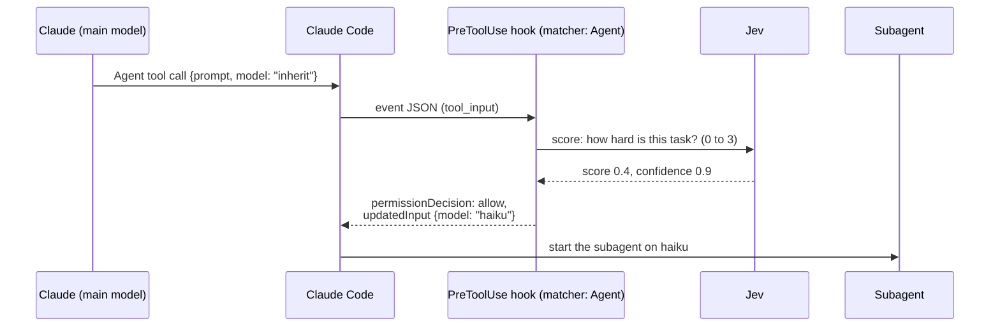

# Claude Code Support for the Decision Points

Claude Code does not natively support all four decision points. Points 3 and 4 work fully. Point 1 works in part. Point 2 (model routing) works fully for subagents, and only through a skill for the main model. [Model routing in Claude Code](09-model-routing.md) has the full details and a test.

This page is about Claude Code alone, with no proxy, gateway, or other harness.

## Summary

```
 Point                              Native support    Hook event
 ─────────────────────────────────  ────────────────  ─────────────────────────
 1  Which skills or tools to load   ◐ partial         UserPromptSubmit
 2  Which model or agent to use     ◐ partial         PreToolUse on Agent (subagents)
 3  Before a tool runs              ● full            PreToolUse
 4  After a result comes back       ◕ mostly          PostToolUse, Stop, SubagentStop
```

| Point | Native? | What a hook can do | What a hook cannot do |
| --- | --- | --- | --- |
| **1. Which skills or tools to load** | Partial | A `UserPromptSubmit` hook can add text to the prompt (ex. "use skill X"), or block the prompt. | It cannot remove skills or tools. Claude Code puts all skill descriptions and tool definitions in each request. Jev can recommend, and Claude still sees everything. |
| **2. Which model or agent** | Subagents: yes. Main model: only through a skill. | A `PreToolUse` hook on the Agent tool can change the subagent model with `updatedInput` (tested on 2.1.291). A hook can recommend a skill whose `model:` field switches the main model for one turn. | No hook can start a switch of the main model. Without a skill, the main model changes only by hand (`/model`, `--model`) or by `opusplan` (Opus in plan mode, Sonnet otherwise). |
| **3. Before a tool runs** | Yes | A `PreToolUse` hook can allow, deny, or ask. It can also change the tool input with `updatedInput`. | - |
| **4. After a result comes back** | Mostly | `PostToolUse` can add context or send feedback to Claude. `Stop` and `SubagentStop` can send Claude back to work. | It cannot replace or remove the result of a built-in tool. Claude already has the result. The hook can only add a warning. |

## Why: hooks control actions, not the request

Claude Code builds each request itself: system prompt, tools, skills, and model. No hook can change those parts. A hook can only add text, or allow, block, or change one tool call.

```
            ┌──────────── Claude Code builds this. Hooks cannot change it. ───────────┐
            │  system prompt   +   tool definitions   +   skill list   +   model      │
            └─────────────────────────────────────────────────────────────────────────┘
                                             +
            ┌──────────── Hooks can touch these parts ────────────────────────────────┐
            │  extra text in the prompt (UserPromptSubmit, PostToolUse)               │
            │  allow / ask / deny / changed input for one tool call (PreToolUse)      │
            │  "keep working" at the end of a turn (Stop, SubagentStop)               │
            └─────────────────────────────────────────────────────────────────────────┘
```

That is why the two safety gates (points 3 and 4) work well in Claude Code, and the two prompt-building points (1 and 2) work only in part. Point 2 works for subagents because a subagent starts with a tool call, and a hook can change a tool call.

## Model routing in Claude Code

No hook can switch the **main** model by itself. A skill with a `model:` field can switch it for one turn, but Claude decides whether to invoke the skill. Fixed routing of the main model for each request needs code that builds the request: the Agent SDK `model` option, or a proxy set with `ANTHROPIC_BASE_URL`.

Inside Claude Code, there are three methods. Method A is the only hard rule.

### Method A: change the subagent model with a hook (a hard rule)

Claude starts a subagent with the Agent tool. That tool has a `model` parameter. A `PreToolUse` hook on the Agent tool can ask Jev about the task, and then use `updatedInput` to set `model` to `haiku` or `opus`. Claude does not get a say.



> **Tested on Claude Code 2.1.291.** Claude asked for `opus`, the hook changed it to `haiku`, and `modelUsage` showed Haiku and no Opus. An older issue (#44412) said that this did not work, so test it again after an upgrade. See [Model routing in Claude Code](09-model-routing.md#test-rewrite-the-subagent-model-with-a-hook).

### Method B: suggest a subagent (a soft rule)

A `UserPromptSubmit` hook adds text such as: "Jev rates this as a simple lookup. Delegate it to the `fast-search` subagent." The subagent file sets `model: haiku`. This method is weaker, because Claude decides whether to follow the text.

### Method C: routing skills (the main model, one turn)

Add skills that set a model, ex. `quick-answer` with `model: haiku` and `deep-think` with `model: opus` and `effort: high`. `jev-skill-picker` recommends one. When Claude invokes it, the main model changes for the rest of that turn, and the session model comes back on the next prompt.

| | Method A (PreToolUse, `updatedInput`) | Method B (UserPromptSubmit) | Method C (routing skill) |
| --- | --- | --- | --- |
| Who decides | The hook | Claude | Claude |
| Works on | Each subagent call | Only when Claude delegates | The main model, for one turn |
| Cache cost | None for the parent | None for the parent | A full re-read for that turn |
| Risk | A wrong score sends a hard task to a small model | Claude can ignore the suggestion | Claude can ignore the suggestion |

### Why route subagents and not the main model

Each model has its own prompt cache. A change of the main model (by `/model`, `opusplan`, or a skill `model:` field) makes the next request read the full history with no cache hits, so it costs more. A subagent starts with its own context and cache anyway, so routing a subagent does not lose a cache.

## What this means for the skills in this repo

| Skill | Point | Effect in Claude Code |
| --- | --- | --- |
| `jev-skill-picker` | 1 | Recommends a skill. It cannot unload the other skills. |
| `jev-compact-advisor` | 2 | Shows advice to the user. It cannot compact or change the model. |
| `jev-bash-gate`, `jev-rule-enforcer` | 3 | Real decisions: allow, ask, or deny. |
| `jev-injection-screen`, `jev-docs-checker` | 4 | Warnings that Claude sees. The result stays in the context. |
| `jev-task-checklist` | 4 | A real decision: block the stop and send Claude back to work. |

A possible new skill is `jev-subagent-router`, which uses Method A. The mechanism is tested, but the skill is not built yet. [Model routing in Claude Code](09-model-routing.md#design-notes-for-a-jev-subagent-router) has design notes.
