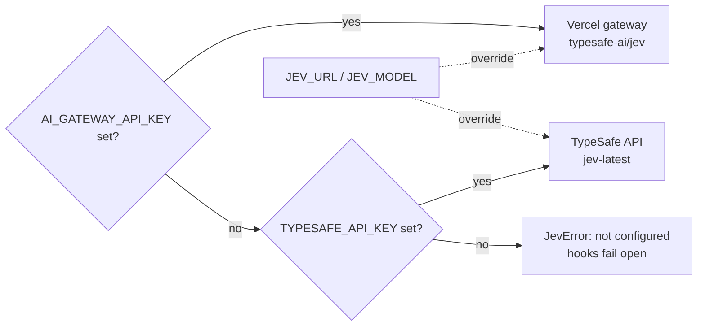

# Connect Jev

## 1. Get access

| Route | Endpoint | Model id | Key |
| --- | --- | --- | --- |
| Vercel AI Gateway (recommended) | `https://ai-gateway.vercel.sh/typesafe/v1/systemone` | `typesafe-ai/jev` | `AI_GATEWAY_API_KEY` |
| TypeSafe API | `https://api.typesafe.ai/v1/systemone` | `jev-latest` | `TYPESAFE_API_KEY` |
| OpenRouter | Also lists Jev. Check its docs for the request shape. | | |

- New signups on the TypeSafe platform were paused when the videos were made.
- The Vercel gateway shows a new key one time only. Copy it immediately.
- Do not paste the key into a chat with an agent.

## 2. Save the key and test it

Set the key in the terminal before you start Claude Code, so that Claude Code and its hooks can read it:

```bash
export AI_GATEWAY_API_KEY="<key>"                 # or TYPESAFE_API_KEY
python skills/jev-setup/scripts/jev_client.py     # sends one test question
```

To keep the key for each session, add it to the `env` block of `~/.claude/settings.json`. Do not put it in a project settings file that goes into git.

The client in this repo selects the endpoint from the key that is set:



## 3. Plug it into your tool

| Where | How |
| --- | --- |
| **Claude Code** | Hooks in `settings.json` that call a small script. Each `jev-*` hook skill has the snippet. A hook can deny, ask the user, or add context for Claude. See [Jev in an agent loop](03-agent-loop.md). |
| **Your own harness** | Call the HTTP API at the four decision points, or give the agent an `ask_jev` tool. |
| **LangChain** | Middleware that adds the decision points. |
| **Pydantic AI** | TypeSafe as a model that you plug into the agent loop. |
| **Vercel AI SDK** | A `decide()` style API for Choice, Score, and Boolean questions. |

## 4. Escalate uncertain answers

Through the Vercel gateway, a **decision fallback** reruns a request on a stronger model when a Choice or Score confidence is low. Both stages are billed.

```python
from jev_client import ask, choice, gateway_fallback

answers = ask(
    state,
    {"intent": choice("Which intent does `message` show?", options)},
    extra=gateway_fallback("anthropic/claude-sonnet-5-5", "intent", 0.6),
)
```

`gateway_fallback` adds this to the request:

```json
{
  "providerOptions": {
    "gateway": {
      "models": [
        { "model": "anthropic/claude-sonnet-5-5", "when": { "question": "intent", "confidenceBelow": 0.6 } }
      ]
    }
  }
}
```

The model id in this example is not verified. Check it in the gateway catalog.
