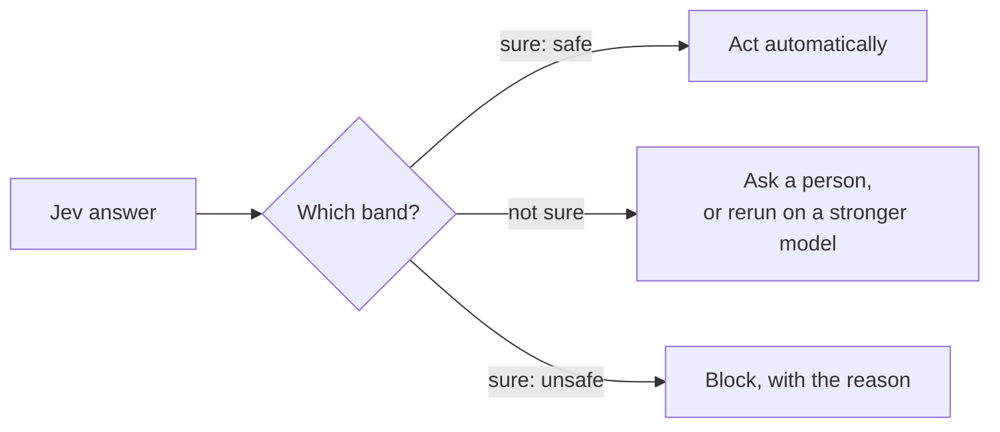
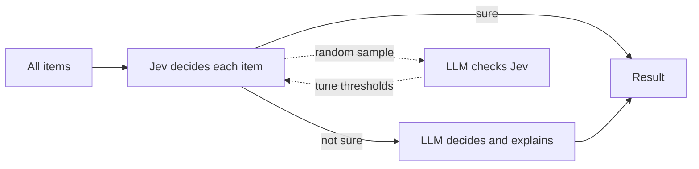

# Design Rules

## Thresholds are policy

Keep the raw probabilities. Set thresholds in code or config, not in the prompt. A threshold is a policy decision, not a fact about the model.

Use **bands**, so that uncertain cases go to a person or a stronger model:

```
 P(bad)  0.0                     0.5                0.8               1.0
         ├───────────────────────┼──────────────────┼─────────────────┤
         │       let it pass     │   ask a person   │      block      │
         └───────────────────────┴──────────────────┴─────────────────┘
```

These are the bands of `jev-bash-gate` and `jev-rule-enforcer`. "A wrong answer costs more than asking a human" (IndyDevDan, level 4).



## Ask one narrow thing per question

Split compound questions. Put the full meaning in the question text. Define every answer in the criteria.

| Bad | Good |
| --- | --- |
| "Is this command dangerous or does it send data out?" | Two `noul` questions: `destructive` and `exfiltration` |
| `choice` with the options `a`, `b`, `c` | Options with a description each, ex. `read_only: "Only reads"` |

## Ask independent questions together

Questions about the same state go in one request. They run in parallel, and the response time almost does not change. Send a second request only when a question needs an earlier answer to build its state or its options.

## Keep the state short

Accuracy and latency get worse with long input. Retrieve the relevant part first, or split the state into chunks (ex. `jev-injection-screen` asks one question per 4,000-character chunk).

## Add a pass instead of giving up

If one pass is not accurate enough, screen broadly, then ask a narrower question about the items that pass. Later, merge the passes when your data shows the pattern (Lindquist).

```
 1,000 items ──► pass 1: broad noul ──► 120 items ──► pass 2: narrow choice ──► 15 items
```

## Try another question type

A question that does not work as a yes/no can work as a choice or a score (Claire Vo).

## Weight in code, not in the prompt

Score each dimension separately. Combine the scores with weights in code. Then you tune a number, not a prompt.

```python
risk = 0.5 * scores["security"] + 0.3 * scores["blast_radius"] + 0.2 * scores["test_gap"]
```

A weighted sum is correct for preferences that can balance each other. For an "any serious problem" rule, use separate conditions instead.

## Escalate, then explain

Let Jev decide at scale. Let an LLM check a sample, handle the uncertain band, and write a one-line reason where a person needs one.



## Test on your own cases

Typed output guarantees the shape of the answer, not the truth. Measure accuracy, and compare it with a baseline, on labeled cases before you trust a threshold. A baseline that always says "irrelevant" scored 90.6% on one data set, so a high accuracy alone proves little.

Use `jev-eval` in this repo: it reports accuracy, a threshold sweep with precision, recall, and F1, the majority baseline, latency, and the worst misses.

## Rules for hooks that call Jev

- **Fail open** for advice. If Jev is not configured or a request fails, write a short message to stderr and exit 0.
- **Fail closed** only where a missed check costs more than a blocked action, and make it a setting.
- Keep a short timeout (10 to 20 seconds). A hook runs on each matching event.
- Never print the API key.
