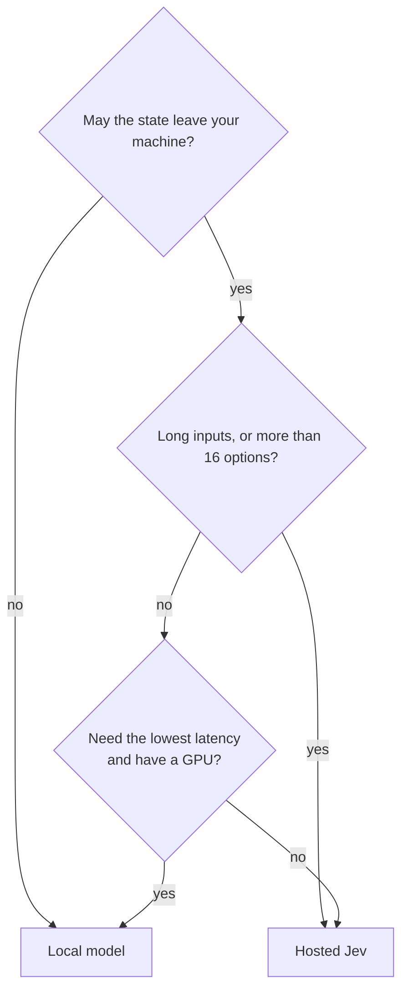

# Speed, Cost, and Local Models

The figures on this page are claims and measurements from the videos. They are not checked. Prices change. Use them as a sense of scale.

## Speed and cost claims

| Claim | Figure | Source |
| --- | --- | --- |
| Price | About $0.04 per 1M input tokens. Output is free. | How I AI |
| Total spend on hundreds of demos | $0.73 | John Lindquist |
| One million triage calls | About $20, against $11,000 on a frontier LLM | IndyDevDan |
| Chess against a low-reasoning LLM | 10x faster per move, 4x cheaper | John Lindquist |
| Rank 35 files | 1.6 s, with the correct file first | AI LABS |
| Compaction | Less than 1 s | AI LABS |

## Benchmark: The AI Automators, more than 7,000 decisions

Answer accuracy on the full set:

```
 Jev (hosted)  ███████████████████████████████████████████████▌  95.2%
 Winnow 12B    ███████████████████████████████████████████████▎  94.6%
 Decider 4B    ███████████████████████████████████████████████▏  94.5%
 Nimble 9B     ██████████████████████████████████████████████    92.0%
               0%                                            100%
```

The four models are close. The results in each category are different, and a small model won some categories.

Latency:

| Model | Short input | About 20,000-token input |
| --- | --- | --- |
| Jev (hosted) | 245 ms | 0.36 s |
| Winnow 12B (local, RTX 5090) | 56 ms | About 3 s |
| Decider 4B (local, RTX 5090) | 47 ms | About 2 s |

```
 latency
   3 s ┤                                   ● Winnow 12B
       │                                ● Decider 4B
   2 s ┤
       │
   1 s ┤
       │                                   ■ Jev (hosted)
   0 s ┤ ●● local          ■ Jev
       └──────────────────────────────────────────────
         short input                  ~20K-token input
```

Local models are faster with short input. Hosted Jev is much faster with long input.

## Hosted Jev or a local decision model

| Hosted Jev | Open decision models |
| --- | --- |
| One API key. Nothing to run. | Winnow 12B (about 13 GB of GPU memory), Decider 4B (about 8 GB), Laya (0.4B, less than 2 GB) |
| The best total accuracy in the benchmark | Private and air-gapped. You can fine-tune them on your data. |
| Fast with long input | Faster with short input. Slower with long input. |
| Up to 255 options per choice | Check the limits: some accept only 16 options or 8K tokens of input. |
| Text only | Some can read images. |
| **Your state leaves your machine.** | Your state stays on your hardware. |



If a local server accepts the same request shape, set `JEV_URL` and `JEV_MODEL` to point the client in this repo at it. Test it with `jev-eval` first.
