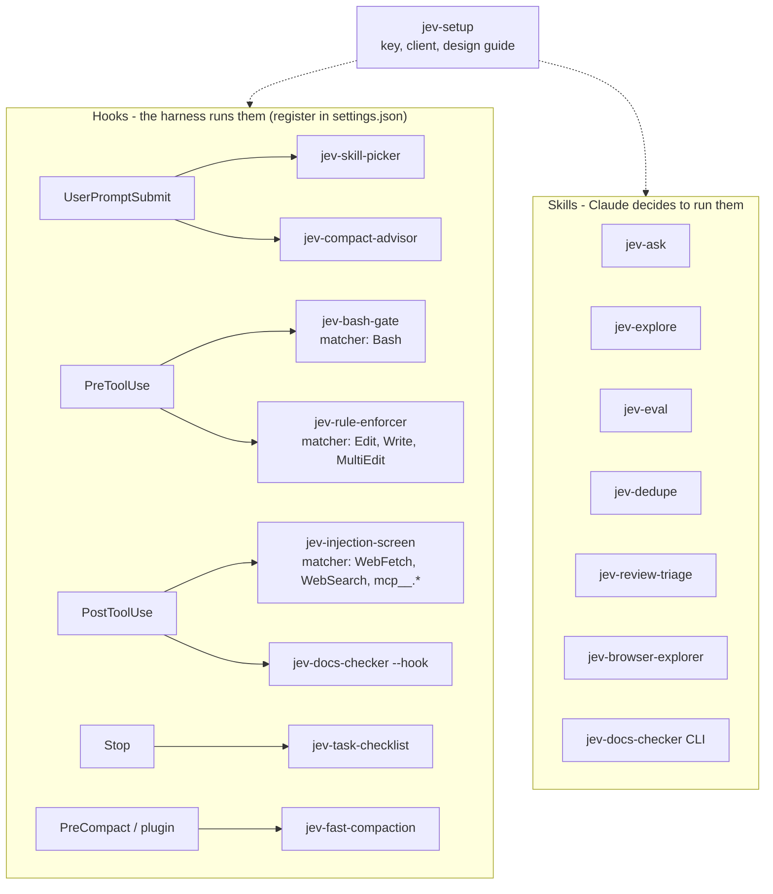

# The Skill Kit

This repo has 15 draft skills built from the videos. Each one calls the shared client in `skills/jev-setup/scripts/jev_client.py`. The hooks fail open: if Jev is not available, Claude continues as usual.

## Where each skill runs

## Skill table

| Skill | Mechanism | Where it runs | Decision |
| --- | --- | --- | --- |
| [jev-setup](../../skills/jev-setup/SKILL.md) | Setup | - | Key, client, and design guide |
| [jev-eval](../../skills/jev-eval/SKILL.md) | Skill | On demand | Is this question accurate enough, and at which threshold? |
| [jev-ask](../../skills/jev-ask/SKILL.md) | Skill | On demand, as a tool | Yes/no, choice, or score about files or command output |
| [jev-explore](../../skills/jev-explore/SKILL.md) | Skill | On demand | Which files answer the question? |
| [jev-skill-picker](../../skills/jev-skill-picker/SKILL.md) | Hook | `UserPromptSubmit` | Which skill, or none? (category cascade for many skills) |
| [jev-compact-advisor](../../skills/jev-compact-advisor/SKILL.md) | Hook | `UserPromptSubmit` | Did the task change while the context is large? |
| [jev-fast-compaction](../../skills/jev-fast-compaction/SKILL.md) | Plugin | `PreCompact` or function hooks | Keep or drop each old tool call |
| [jev-bash-gate](../../skills/jev-bash-gate/SKILL.md) | Hook | `PreToolUse` (Bash) | Read-only, reversible, or irreversible? |
| [jev-rule-enforcer](../../skills/jev-rule-enforcer/SKILL.md) | Hook | `PreToolUse` (edits) | Does this edit break a rule for this file? |
| [jev-injection-screen](../../skills/jev-injection-screen/SKILL.md) | Hook | `PostToolUse` (web, MCP) | Does this result try to give the agent orders? |
| [jev-docs-checker](../../skills/jev-docs-checker/SKILL.md) | Skill and hook | `PostToolUse`, on demand | Does each documented rule have a test? |
| [jev-task-checklist](../../skills/jev-task-checklist/SKILL.md) | Hook | `Stop` | Is each checklist item done? |
| [jev-review-triage](../../skills/jev-review-triage/SKILL.md) | Skill | On demand | Quick review or full review? |
| [jev-browser-explorer](../../skills/jev-browser-explorer/SKILL.md) | Skill | On demand (Playwright) | Which button or link next? |
| [jev-dedupe](../../skills/jev-dedupe/SKILL.md) | Skill | On demand | Are these two records the same entity? |

## Start here

1. Install `jev-setup` and test the key.
2. Use `jev-eval` to tune the thresholds of each hook before you depend on it.
3. Add the hooks that you want to `settings.json`. A hook skill does nothing until you register it.

## Status and known limits

- All skills were tested against a local mock of the Jev API, not against the live API.
- `jev-browser-explorer` is not tested, because Playwright was not installed.
- The thresholds are first guesses (ex. 0.8 to block, 0.5 to ask).
- `jev-dedupe` compares only records that share a word. It cannot pair "IBM" with "International Business Machines".
- `jev-eval` expects score labels as level numbers.
- `jev-task-checklist` does not see work that is already committed. Its evidence is `git diff HEAD`.
- `jev-compact-advisor` estimates the context size from the characters in the transcript.
- Not built: `jev-subagent-router` (the hook mechanism is tested, see [Model routing in Claude Code](09-model-routing.md)) and collision avoidance for parallel agents.
