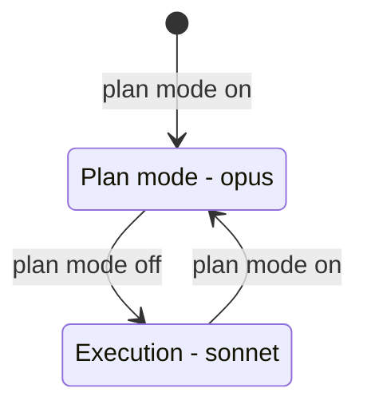
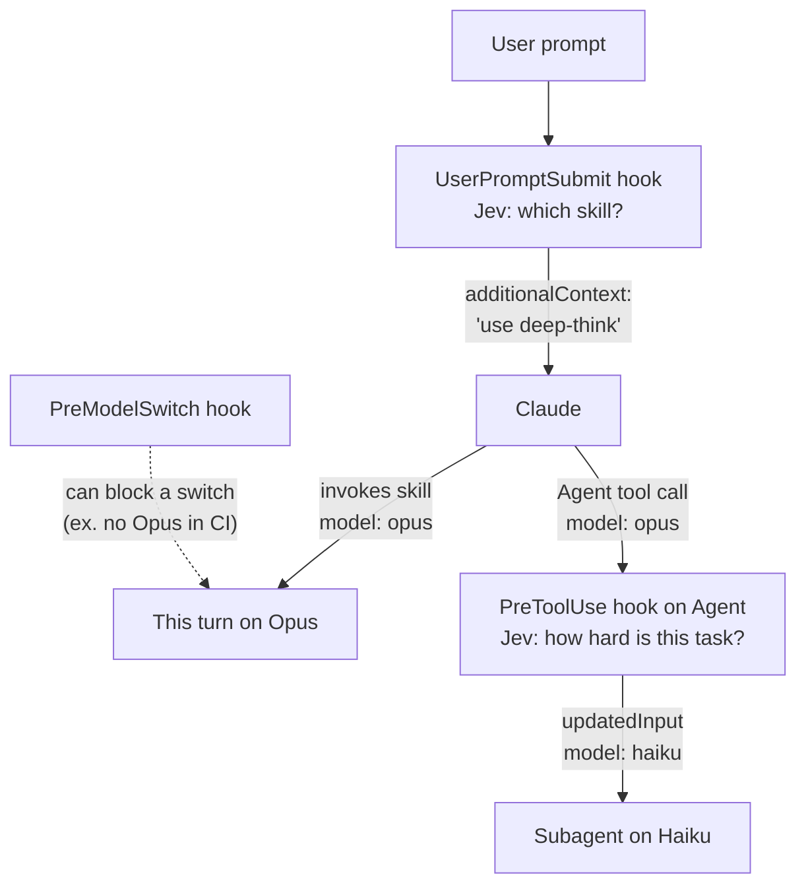

# Model Routing in Claude Code

This page lists every way to choose or change the model **natively** in Claude Code: no proxy, no gateway, no third-party router. It then shows where Jev can make the routing decision.

Facts were checked against the Claude Code docs and tested on Claude Code 2.1.291 in October 2026. Claude Code changes fast. Check the docs for your version.

## Summary

```
                         ┌─────────────── who decides ───────────────┐
 Scope                   │ You (fixed)       Claude        A hook    │
 ──────────────────────  ┼───────────────────────────────────────────┤
 Session (main model)    │ /model, --model   -             - (*)     │
 Plan / execute phases   │ opusplan          -             -         │
 One turn                │ -                 skill model:  -         │
 Each subagent           │ frontmatter,      Agent tool    PreToolUse│
                         │ env var           model param   updatedInput
 Effort (not a model)    │ /effort,          skill/agent   -         │
                         │ modelSettings     effort:                 │
 On a refusal            │ fallbackModel     -             -         │
                         └───────────────────────────────────────────┘
 (*) A PreModelSwitch hook can block a switch, but no hook can start one.
```

| Need | Native method | Who decides | Cache cost |
| --- | --- | --- | --- |
| A different main model for the session | `/model`, `--model`, `ANTHROPIC_MODEL`, `model` in settings | You | Full re-read on the next request |
| Opus to plan, Sonnet to do the work | `opusplan` alias | Plan mode on or off | Full re-read at each plan-mode toggle |
| A different model for one turn | `model:` in a skill or command frontmatter | Claude or you, when the skill runs | Full re-read for that turn |
| A different model for a subagent | `model:` in the agent file, the Agent tool `model` parameter, `CLAUDE_CODE_SUBAGENT_MODEL` | You or Claude | None for the parent. The subagent has its own cache. |
| A **hard rule** for subagent models | `PreToolUse` hook on `Agent` with `updatedInput.model` | **The hook (Jev)** | None for the parent |
| Less or more reasoning on one model | `/effort`, `effortLevel`, `modelSettings`, `effort:` in a skill or agent | You or the skill | Kept on Opus 5.5, Sonnet 5.5, Fable 5.1 (API key or subscription) |
| A backup model | `--fallback-model`, `fallbackModel` | Claude Code | Full re-read |

## 1. The session model

| Method | Syntax |
| --- | --- |
| Command in the session | `/model sonnet` |
| Start flag | `claude --model opus` |
| Environment variable | `ANTHROPIC_MODEL=sonnet` |
| Settings | `"model": "sonnet"` in `settings.json` |

Aliases: `default`, `best`, `fable`, `opus`, `sonnet`, `haiku`, `sonnet[1m]`, `opus[1m]`, `opusplan`.

The variables `ANTHROPIC_DEFAULT_OPUS_MODEL`, `ANTHROPIC_DEFAULT_SONNET_MODEL`, `ANTHROPIC_DEFAULT_HAIKU_MODEL`, and `ANTHROPIC_DEFAULT_FABLE_MODEL` set which model each alias points to. `ANTHROPIC_DEFAULT_HAIKU_MODEL` also sets the model for background work (ex. session titles). `ANTHROPIC_SMALL_FAST_MODEL` is deprecated.

### `opusplan`: the only automatic switch of the main model



The switch follows plan mode, not the difficulty of the task. Each toggle is a model switch, so the next request reads the full history with no cache hits.

## 2. One turn: the skill `model` field

A skill (or a `.claude/commands/*.md` command) can name a model in its frontmatter:

```yaml
---
name: deep-think
description: Use for architecture decisions and hard debugging that need careful reasoning.
model: opus
effort: high
---
```

- The override applies for the rest of the current turn. The session model comes back on the next prompt. It is not saved to settings.
- With `context: fork`, the model applies to the forked subagent instead of the main conversation.
- A model that the `availableModels` allowlist does not permit is not used.
- When the skill model is different from the session model, that turn reads the full history with no cache hits.

**This is the only native way to change the main model for one turn without a person.** Claude starts the switch by invoking the skill. A hook cannot force a skill to run. It can only recommend one.

## 3. Subagents

Claude Code resolves a subagent's model in this order:

```
 1. The Agent tool `model` parameter      ◄── Claude sets it per call; a PreToolUse hook can rewrite it
 2. `model:` in the agent file            ◄── haiku, sonnet, opus, fable, a full id, or inherit
 3. CLAUDE_CODE_SUBAGENT_MODEL            ◄── a default for subagents with no model
 4. The main conversation model
```

- `CLAUDE_CODE_SUBAGENT_MODEL_FORCE=1` makes the variable override steps 1 and 2 for every subagent. Forks, and skills that fork with `model: inherit`, still use the main model.
- The built-in Explore agent runs on Opus on the Anthropic API. To run it on Haiku, add your own agent named `Explore` with `model: haiku`.
- A subagent has its own cache, so a different model costs nothing in the parent's cache.
- Run `/tasks` to see the model of each subagent.

```yaml
---
name: fast-search
description: Fast, read-only search across the codebase.
model: haiku
effort: low
tools: Read, Grep, Glob
---
```

## 4. Hooks and the model

| Hook | What it can do with the model | Tested |
| --- | --- | --- |
| `PreToolUse` on `Agent` | **Change the subagent model** with `updatedInput.model`. | Yes, works on 2.1.291 |
| `PreToolUse` on `Skill` | Change which skill runs with `updatedInput`, and so the turn model. | No |
| `PreModelSwitch` | Block a switch, or add context. It fires for `/model`, skill overrides, subagent models, and internal switches. It cannot start a switch. | No |
| `PostModelSwitch` | Log the switch, or add context for Claude. | No |
| `UserPromptSubmit` | Nothing. It can only add context or block the prompt. | - |
| `SubagentStart` | Nothing. It sees the agent type, but it cannot change the model. | - |

### Test: rewrite the subagent model with a hook

The hook takes the Agent tool input, sets `model` to `haiku`, and returns the full input as `updatedInput`. (`updatedInput` replaces the arguments, so it must contain all the fields, not only `model`.)

```python
event = json.load(sys.stdin)
tool_input = dict(event.get("tool_input") or {})
tool_input["model"] = "haiku"
print(json.dumps({"hookSpecificOutput": {
    "hookEventName": "PreToolUse",
    "permissionDecision": "allow",
    "updatedInput": tool_input,
}}))
```

```json
{ "hooks": { "PreToolUse": [ { "matcher": "Agent|Task",
  "hooks": [ { "type": "command", "command": "python /path/to/route_hook.py" } ] } ] } }
```

The test prompt told Claude (Sonnet) to start one subagent with `model: opus`. `claude -p --output-format json` reports `modelUsage` for each model:

| Run | Model that Claude asked for | Models in `modelUsage` |
| --- | --- | --- |
| Control, no hook | `opus` | `claude-sonnet-5-5`, `claude-opus-5-5` |
| With the hook | `opus` (the hook saw `"original_model": "opus"`) | `claude-sonnet-5-5`, `claude-haiku-4-5-20251001` |

The subagent ran on Haiku, and Opus was not used.

> **Earlier reports said this did not work.** GitHub issue [#44412](https://github.com/anthropics/claude-code/issues/44412) (April 2026) said that `updatedInput` was ignored for the Agent tool. Issue [#69545](https://github.com/anthropics/claude-code/issues/69545) asked for `SubagentStart` to support `updatedInput`, and was closed as not planned. A later comment on #69545 said that a `PreToolUse` hook works. Our test agrees with that comment for version 2.1.291. Test it again after an upgrade.

## 5. Effort: a cheaper lever than a model switch

Effort controls how much the model thinks, on the same model.

| Method | Syntax |
| --- | --- |
| Command | `/effort high`, `/effort auto` |
| Setting | `"effortLevel": "medium"` (`max` is not accepted as a saved setting) |
| Per model | `"modelSettings": { "opus": { "effortLevel": "high" }, "sonnet": { "effortLevel": "medium" } }` |
| Per skill or agent | `effort: low` in the frontmatter |
| Upper limit (managed settings) | `"maxEffortLevel": "high"` |

On Opus 5.5, Sonnet 5.5, and Fable 5.1 with an API key or a subscription, an effort change keeps the cache. On most other setups it does not.

## 6. Limits and backups

| Setting | Effect |
| --- | --- |
| `availableModels` (managed) | Only these models can be selected. A blocked subagent alias goes to the newest permitted model of that family. |
| `deniedModels` (managed, 2.1.283 or later) | Block some models even when `availableModels` permits them. |
| `--fallback-model sonnet,haiku`, `fallbackModel` | Models for automatic model fallback, ex. when a safety classifier flags a request. This is also a model switch. |

## 7. The Agent SDK

The Agent SDK is Anthropic's own harness. The `model` option of `query()` (Python and TypeScript) sets the model for each query. Your code can ask Jev first and pass the result:

```python
level = jev_score(task)                    # 0 to 3
model = ["haiku", "sonnet", "opus", "opus"][round(level)]
async for message in query(prompt=task, options=ClaudeAgentOptions(model=model)):
    ...
```

This gives real routing of the main model for each request, because your code builds the request. A method to change the model inside a running streaming session was not found in the docs.

## Where Jev makes the routing decision



| Pattern | Mechanism | Strength | Status in this repo |
| --- | --- | --- | --- |
| **Subagent router** | `PreToolUse` on `Agent`. Jev scores the task in `tool_input.prompt` and sets `updatedInput.model`. | Hard rule. Claude cannot override it. | Not built (`jev-subagent-router`). The mechanism is tested. |
| **Routing skills** | Skills such as `quick-answer` (`model: haiku`) and `deep-think` (`model: opus`, `effort: high`). `jev-skill-picker` recommends one. | Soft. Claude decides whether to invoke it. | `jev-skill-picker` exists. The routing skills are not built. |
| **Switch guard** | `PreModelSwitch` hook that blocks some switches, ex. no Opus in a CI session. | Hard rule, but it can only block. | Not built. Jev is not needed for a fixed rule. |
| **SDK router** | Your Agent SDK code asks Jev, then passes `model` to `query()`. | Hard rule for the main model. | Not built. |

### Design notes for a Jev subagent router

- **Ask a Score, not a Choice of models.** Ask "How hard is this task?" on levels that describe tasks (ex. "a lookup or a search", "a routine edit", "design work or hard debugging"). Map the score to a model in code. Then a new model needs only a code change.
- **Use the confidence.** When the confidence is low, keep the model that Claude asked for. Downgrade only when Jev is sure.
- **Respect the agent file.** If the agent file sets a model on purpose, consider leaving it. Read `tool_input.subagent_type` to decide.
- **Return the full input.** `updatedInput` replaces all arguments. Copy `tool_input`, then change only `model`.
- **Measure.** Test the router with `jev-eval` on real subagent prompts, and compare the token use in `modelUsage` before and after.

## Sources

- [Model configuration](https://code.claude.com/docs/en/model-config): aliases, `opusplan`, environment variables, effort, `availableModels`, fallback.
- [Subagents](https://code.claude.com/docs/en/sub-agents): the model resolution order, `CLAUDE_CODE_SUBAGENT_MODEL_FORCE`, the Explore agent.
- [Skills](https://code.claude.com/docs/en/skills): the `model`, `effort`, `context`, and `agent` frontmatter fields.
- [Hooks](https://code.claude.com/docs/en/hooks): `updatedInput`, `PreModelSwitch`, `PostModelSwitch`, `UserPromptExpansion`, hooks in skills and agents.
- [Prompt caching](https://code.claude.com/docs/en/prompt-caching): which switches cost a full re-read.
- GitHub issues [#44412](https://github.com/anthropics/claude-code/issues/44412) and [#69545](https://github.com/anthropics/claude-code/issues/69545), read through the [claudeissues.com](https://claudeissues.com/issue/69545-feature-request-subagentstart-hook-should-support-updatedinput-to-enable-determi) mirror.
- Our own test, Claude Code 2.1.291, October 2026.
